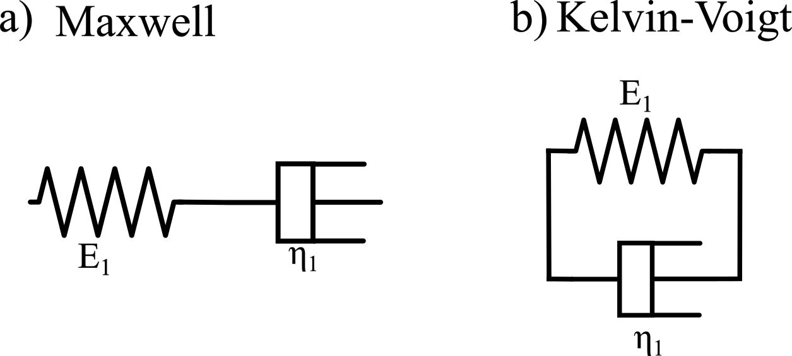

# SofaViscoElastic

## Table of contents
* [Introduction](#introduction)
* [Python Functions and Bindings](#python-functions-and-bindings)
* [Algorithm](#algorithm)
* [Examples](#examples)

## Introduction
SofaViscoElastic is a plugin for the Software Open Architecture Framework (SOFA) which implements the fundamental linear viscoelastic constitutive laws applied to tetrahedral meshes.
Viscoelasticity is a property of elastomeric materials that influences their mechanical behavior under dynamic conditions. In fact, viscoelastic constitutive equations are dependent on the stress/strain rate. At low stress/strain rates, a viscoelastic material behaves like a viscous liquid-like material, while at high stress/strain rates, the same material behaves like a Hookean solid. In fact, the simplest viscoelastic models are:

These two models represent the basic unit that constitutes the viscoelastic materials. They are composed of an elastic part described by the spring symbol and a viscous one represented by the dashpot.
Anyway, the Maxwell and the Kelvin-Voigt models describe the behavior of a few kinds of materials, like silly-putty, gels, etc. Furthermore, they are theoretical models that are not stable under creep (Maxwell) or stress relaxations (Kelvin-Voigt) conditions. 
Elastomers and rubbers are polymeric materials present in nature but are also used in several industrial applications. Many research fields are involved in developing and using new elastomeric materials and rubbers, such as soft robotics and surgical applications. For this reason, this plugin is indicated for users who want a realistic mechanical simulation of these materials afflicted by the viscoelastic effect.
To describe their viscoelastic properties, different viscoelastic models have to be used, like the Standard Linear Solid (SLS) Maxwell/Kelvin-Voigt representation:

They add another spring in parallel (Maxwell representation) or in series (Kelvin-Voigt representation) to make the model stable under creep and stress relaxation and are excellent for describing viscoelastic polymer rheology. In the SofaViscoElastic plugin, 9 different viscoelastic models are presented. For more info theoretical info the users can refer to the paper "Considering the viscoelastic effects in soft robotic modeling" by Ferrentino et al. submitted in Soft Robotic Journal (SORO). 
 
## Python Functions and Bindings
The principal function of this plugin is the so-called TethrahedronViscoelasticityFEMForceField which applies the viscoelastic constitutive law to the tetrahedral mesh uploaded in SOFA, the syntax in Python is:

## Algorithm

## Examples
 
