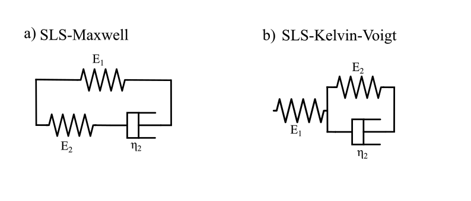
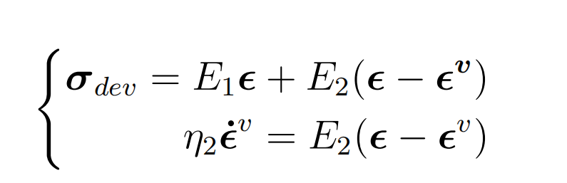
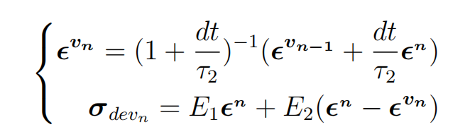

# SofaViscoElastic


## Table of contents
* [Introduction](#introduction)
* [Visco-Hyperelasticity](#viscohyperelasticity)
* [Installation](#installation)
* [Python Functions and Bindings](#python-functions-and-bindings)
* [Algorithm](#algorithm)
* [Applications](#applications)

## Introduction
SofaViscoElastic is a Software Open Architecture Framework (SOFA) plugin that implements the fundamental linear viscoelastic and visco-hyperelastic constitutive laws for tetrahedral meshes.
Viscoelasticity is a property of elastomeric materials that influences their mechanical behavior under dynamic conditions. Viscoelastic constitutive equations are dependent on the stress/strain rate. At low stress/strain rates, a viscoelastic material behaves like a viscous liquid, while at high stress/strain rates, it behaves like a Hookean solid. The simplest viscoelastic models are:


These two models represent the basic units that constitute viscoelastic materials. They are composed of an elastic part, represented by the spring symbol, and a viscous part, represented by the dashpot.
The Maxwell and Kelvin-Voigt models describe the behavior of certain materials, such as silly putty and gels. Furthermore, they are unstable theoretical models under creep (Maxwell) or stress relaxation (Kelvin-Voigt) conditions. 
Elastomers and rubbers are polymeric materials, but they are also used in several industrial applications. Many research fields are involved in developing and using new elastomeric materials and rubbers, such as soft robotics and surgical applications. For this reason, this plugin is recommended for users who want a realistic mechanical simulation of these materials affected by viscoelasticity.
To describe their viscoelastic properties, different viscoelastic models have to be used, like the Standard Linear Solid (SLS) Maxwell/Kelvin-Voigt representation:



They add another spring in parallel (Maxwell representation) or in series (Kelvin-Voigt representation) to make the model stable under creep and stress relaxation. They are excellent for describing the rheology of viscoelastic polymers. The SofaViscoElastic plugin presents nine different viscoelastic models. For more theoretical information, users can refer to the paper "Considering the viscoelastic effects in soft robotic modeling" by Ferrentino et al., submitted to the Soft Robotic Journal (SORO). 

## Visco-Hyperelasticity
The visco-hyperelastic model describes the mechanical behavior of the elastomers in large deformations. In this regime, the hyperelasticity of the material is shown in parallel to the viscous effects, in particular, for this plugin:


Hence, it combines the hyperelastic models already implemented in Sofa with Maxwell Branches. The user can choose for each visco-hyperelastic model until the second order (two Maxwell branches in parallel).   

## Hysteresis
Hysteresis is automatically included by including dashpots in the system. Anyway, this plugin doesn't yet model the Mullin effect. The Mullins effect is a strain-softening phenomenon in elastomers, where the stress-strain curve irreversibly softens after the first loading cycle, depending on the maximum strain previously reached. 

## Installation
This plugin is available for Ubuntu/Linux, Macintosh, and Windows. The only dependency is the SOFA plugin "SofaPython3" (make sure it is installed).
To install this plugin from the source, the user has to download this folder and place it in:
```
 $ /home/adminName/sofa/src/applications/plugins
```
Then, the user has to write this in the CMakeLists.txt present in the previous destination:
```
$ sofa_add_subdirectory(plugin SofaViscoElastic SofaViscoElastic)
```
Then recompile SOFA, and it should start its installation. Enjoy!
If you have any problems, please contact the author at pasquale.ferrentino@vub.be.

## Python Functions and Bindings
The principal function of this plugin is the so-called TethrahedronViscoelasticityFEMForceField, which applies the viscoelastic constitutive law to the tetrahedral mesh uploaded in SOFA. The syntax in Python is the following :


The additional fields to fill in are:
* template: related to the DOF expressed in the Mechanical Object in SOFA.
* name: The name chosen by the user for the function (will appear in the SOFA simulation Graph)
* materialname: The name of the viscoelastic model that the user wants to use; he can choose between:
  (Linear Viscoelasticity)
  - MaxwellFirstOrder
  - KelvinVoigtFirstOrder
  - SLSMaxwellFirstOrder
  - SLSKelvinVoigtFirstOrder
  - Burgers
  - MaxwellSecondOrder
  - KelvinVoigtSecondOrder
  - SLSMaxwellSecondOrder
  - SLSKelvinVoigtSecondOrder
 (Visco-Hyperelasticity)
  - SLSNeohookeanFirstOrder
  - SLSNeohookeanSecondOrder
  - SLSMooneyRivlinFirstOrder
  - SLSMooneyRivlinSecondOrder
  - SLSOgdenFirstOrder
  - SLSOgdenSecondOrder
  - SLSStableNeoHookeanFirstOrder
  - SLSStableNeoHookeanSecondOrder
* ParameterSet: the lists of the material constants proper of the viscoelastic model chosen by the user. In particular, the user has to define the Young Moduli ($E_i$) and the relaxation times ($&tau;_i$) defined as the ratio between the viscosity ($&eta;_i$) and the relative Young modulus. Ultimately, the user must specify the Poisson Ratio (&nu;).


For the simulation, it is strictly recommended to set the Rayleigh coefficient of the Solver to 0:


The simulation results are strictly dependent on the time step (dt). The author advises using this range of time steps:

$$ dt \leq {&tau;_i \over 100} $$
  
Furthermore, in the plugin are integrated some Python Bindings to export some internal parameters of specific tetrahedra:


The user can choose these quantities:
* getShapeVector(): Get the shape Vector of the specific tetrahedron (specified in the brackets).
* getFiberDirection(): get the fiber direction of the tetrahedron.
* getVolume(): get the volume of the tetrahedron.
* getRestVolume(): get the rest volume of the tetrahedron.
* getVolScale(): get the volume scale of the tetrahedron.
* getF(): get the deformation gradient (F) of the tetrahedron.
* getSPKStress(): get the stresses of the Second-Piola Kirchhoff tensor.
* getCauchyStress(): get the stresses Cauchy tensor.
* getVonMisesStress(): get the Von Mises stresses.

P.S. The stresses are per Element, not per Node.
## Algorithm
In Figure 4 of the paper, the SLS-Maxwell model of first order is used as an example to understand the algorithm used in this plugin. 
This section explains the principal steps of the algorithm. First, the plugin aims to calculate the deviatoric and hydrostatic parts of the stress tensor.
The deviatoric part calculation derives from the stress balance on the springs-dashpot 3D model:



Where $&sigma;^{dev}$ is the deviatoric stress tensor, $&epsilon;$ is the strain tensor, while $&epsilon;^{&middot; v}$ is the strain rate which acts in the dashpot of the model.
Applying the discretization of this equation, in particular an Euler backward scheme on the strain rate formulation, we obtain:



The terms with the exponent "n" refer to the quantity calculated at the current time step, while the ones with the exponent "n-1" refer to the quantity calculated at the previous time step. Hence, in viscoelastic materials, the current strain-stress state depends on the previous strain-stress conditions, meaning that the material has "memory" of its last internal stress/strain state.  
Instead, the hydrostatic part of the stress tensor is calculated using this general formula:


 It uses the material's bulk Modulus (K).
## Future works
The Mullin effects on the Hysteresis modeling/parametrization will be added. Stay updated!

## Applications
 The plugin generates various example scenes in Python 3. The examples show a cylindrical beam using viscoelastic constitutive models and undergoing a creep test and a stress-relaxation test. 
 The plugin was developed in collaboration between the Brubotics lab at the VUB (Vrije Universiteit Brussel) and the DEFROST team at the INRIA Institute in Lille. 
 The authors of this plugin are looking for future collaborations for further development.
 For other info, please contact: pasquale.ferrentino@vub.be.
